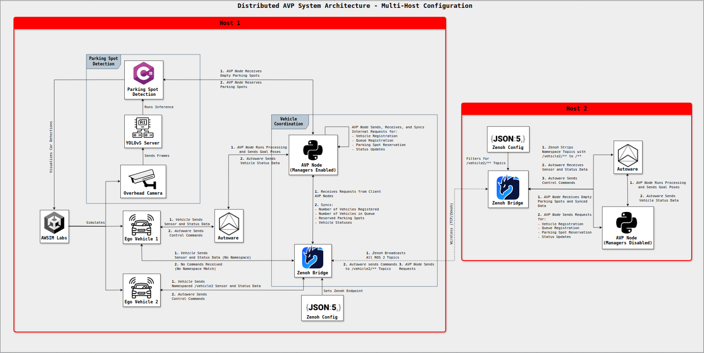
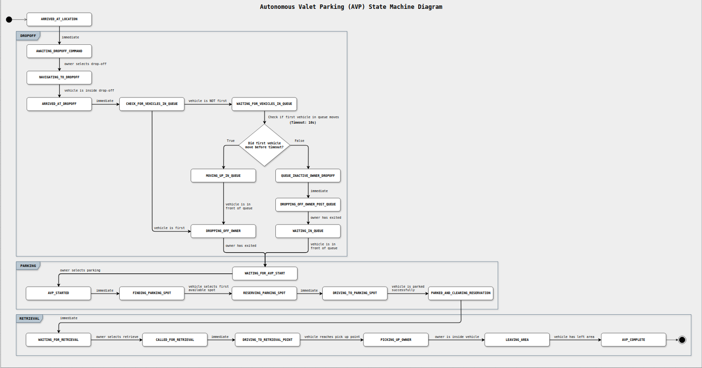

# System Architecture

The Autonomous Valet Parking (AVP) system is built as an extension of the core [Multi-Vehicle AV Framework](https://zubxxr.github.io/multi-vehicle-framework).
It relies on the same architecture, but with added orchestration logic, manager nodes, and namespace handling to enable multi-vehicle parking coordination.

## Distributed AVP Architecture

See diagram in [full view](https://viewer.diagrams.net/?tags=%7B%7D&lightbox=1&highlight=0000ff&edit=_blank&layers=1&nav=1&title=Distributed%20AVP%20System%20Architecture%20-%20Multi-Host%20Configuration&dark=auto#Uhttps%3A%2F%2Fdrive.google.com%2Fuc%3Fid%3D1OdbzL3HdfH8Y_gELLkJN0JoSe5TTd_UL%26export%3Ddownload).

---

## AVP State Machine Flow

See diagram in [full view](https://viewer.diagrams.net/?tags=%7B%7D&lightbox=1&highlight=0000ff&edit=_blank&layers=1&nav=1&title=AVP%20State%20Machine&dark=auto#Uhttps%3A%2F%2Fdrive.google.com%2Fuc%3Fid%3D1e9ikQncDPz8bRWiGY5ZNu6GCJ8BHFljs%26export%3Ddownload).

---

## Software Stack and Version Overview

| **Component**              | **Name**                                | **Version / Branch**                               |
|----------------------------|-----------------------------------------|----------------------------------------------------|
| Operating System           | Ubuntu                                  | 22.04 LTS                                          |
| ROS 2 Distribution         | ROS 2                                   | Humble Hawksbill                                   |
| Autonomy Stack             | Autoware Universe                       | release/2024.11 (modified)                         |
| Simulation Engine          | AWSIM Labs                              | main (modified)                                    |
| Middleware Bridge          | Zenoh Bridge for ROS 2                  | `release/1.4.0`                                    |
| Parking Spot Detection     | YOLO                                    | v5                                                 |
| AVP Orchestration Module   | Multi-Vehicle AVP Node (Custom)         | custom                                             | 

## Host Roles

- **Host 1 (Nitro PC)**:

    - AWSIM Labs simulation (Unity-based)
    - YOLOv5-based parking spot detection server
    - Autoware (vehicle 1 stack)
    - AVP orchestration node (with **manager nodes** enabled)
    - Zenoh Bridge (in router mode)

- **Host 2 (ROG Laptop)**:

    - Autoware (vehicle 2 stack, with `/vehicle2` namespace)
    - A second AVP orchestration node (**no managers**, namespace-aware)
    - Zenoh Bridge (in client mode)

---

## Scalability

The framework can be applied to use multiple hosts/vehicles.

See [Scaling for Multiple Vehicles](scaling-multi-vehicle.md).

---

**Next Steps:** Proceed to [Software Setup](../SoftwareSetup/index.md).
