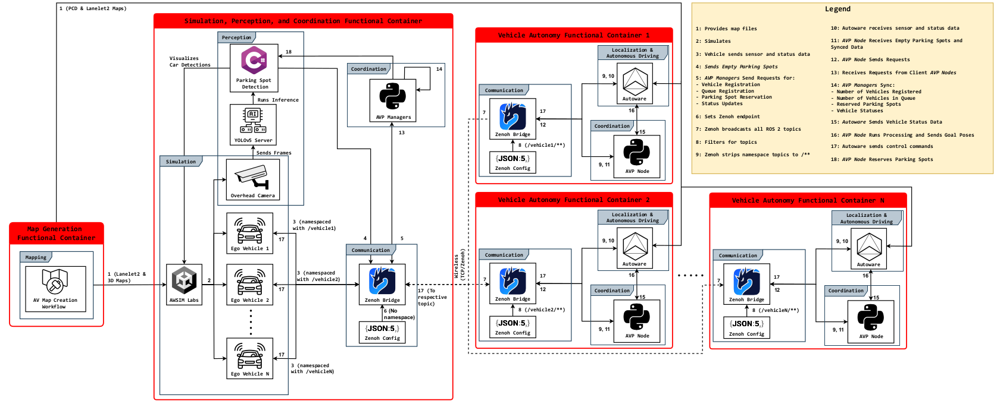
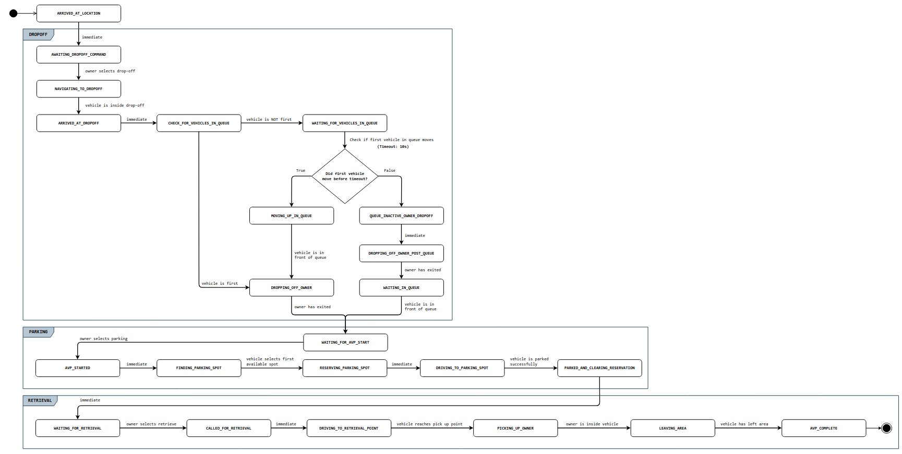

# System Architecture

DMV-AVP is built as an extension of [DMAVA](https://github.com/zubxxr/distributed-multi-autonomous-vehicle-architecture/).
It relies on the same architecture, but with added perception and orchestration logic to enable multi-vehicle AVP.

## System-Level Container-Based Architecture

See diagram in [full view](https://viewer.diagrams.net/?tags=%7B%7D&lightbox=1&highlight=0000ff&edit=_blank&layers=1&nav=1&title=System_Workflow.drawio&dark=auto#Uhttps%3A%2F%2Fdrive.google.com%2Fuc%3Fid%3D1b85Yn9-Ive6wqnY9WORWvKPu27M3SCff%26export%3Ddownload).

---

## AVP State Machine

See diagram in [full view](https://viewer.diagrams.net/?tags=%7B%7D&lightbox=1&highlight=0000ff&edit=_blank&layers=1&nav=1&title=AVP%20State%20Machine&dark=auto#Uhttps%3A%2F%2Fdrive.google.com%2Fuc%3Fid%3D1e9ikQncDPz8bRWiGY5ZNu6GCJ8BHFljs%26export%3Ddownload).

---

## Software Stack and Version Overview

| **Component**                    | **Name**                    | **Version / Branch**            |
|----------------------------------|-----------------------------|---------------------------------|
| Operating System                 | Ubuntu                      | 22.04 LTS                       |
| ROS 2 Distribution               | ROS 2                       | Humble Hawksbill                |
| Autonomy Stack                   | Autoware Universe           | release/2024.11 (modified)      |
| Simulation Engine                | AWSIM Labs                  | main (modified)                 |
| Middleware Bridge                | Zenoh Bridge for ROS 2      | release/1.7.2                   |
| Unity-Integrated YOLOv5 Parking Spot Detection | U-YOLO Module  | v5                              |
| Multi-Vehicle AVP Coordination   | AVP-CF                     | custom                          |
                        | 

## Host Roles

- **Host 1 (Nitro PC)**:

    - AWSIM Labs simulation (Unity-based)
    - U-YOLO module
    - Autoware (vehicle 1 stack)
    - The AVP Managers from the AVP-CF
    - Zenoh Bridge (in router mode)

- **Host 2 (ROG Laptop)**:

    - Autoware (vehicle 2 stack, with `/vehicle2` namespace)
    - The AVP Node from the AVP-CF
    - Zenoh Bridge (in client mode)

---

## Scalability

DMV-AVP can be applied to use multiple hosts/vehicles.

See [Scaling for Multiple Vehicles](../../Scalability/ScalingToMoreVehicles/index.md).

---

**Next Steps:** Proceed to [Software Setup](../SoftwareSetup/index.md).
